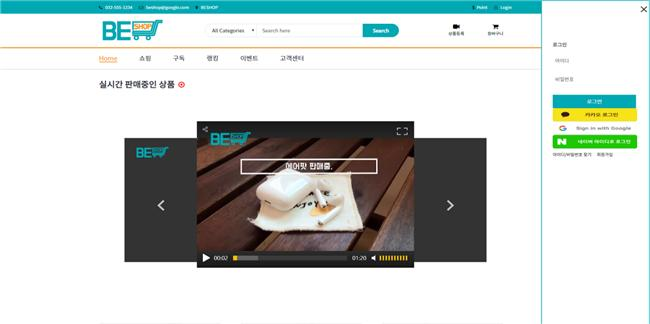

# BESHOP 프로젝트

BESHOP프로젝트 : 누구나 SHOP이 되는 **영상 기반 쇼핑 플랫폼 구축**

### 개발환경 및 사용기술
- 사용(개발)언어 : Java
- 사용 O/S : Windows
- 사용 기술 : Jsp, Ajax, Node.js, HTML5, JavaScript, Kakao API

### 주요특징

- 기업이나 개인 누구나 판매자, 구매자가 되어 쉽게 영상을 통해 중고제품이나 신제품을 사고 팔 수 있는 실시간 양방향 쇼핑사이트

### 주요기능

- SNS 로그인, BESHOP 홈페이지 회원가입을 통한 로그인 기능
- Ajax, Java Mail API를 이용한 회원가입 시 입력한 이메일로 임시 비밀번호 발급
- 판매 상품 소개 영상 업로드 기능
- 상품 상세 페이지에서 Node.Js socket.io을 통한 구매자와 판매자의 실시간 채팅
- 판매 상품 등록 시 게시 시간 예약 기능(SQL 서브 쿼리)
- 아임포트 API를 이용한 포인트 충전, 상품 구매 기능

